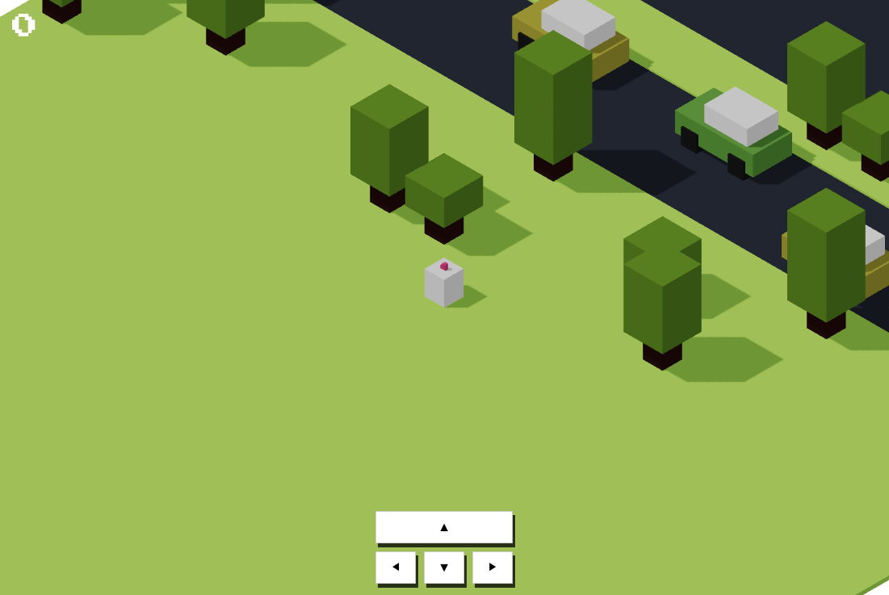
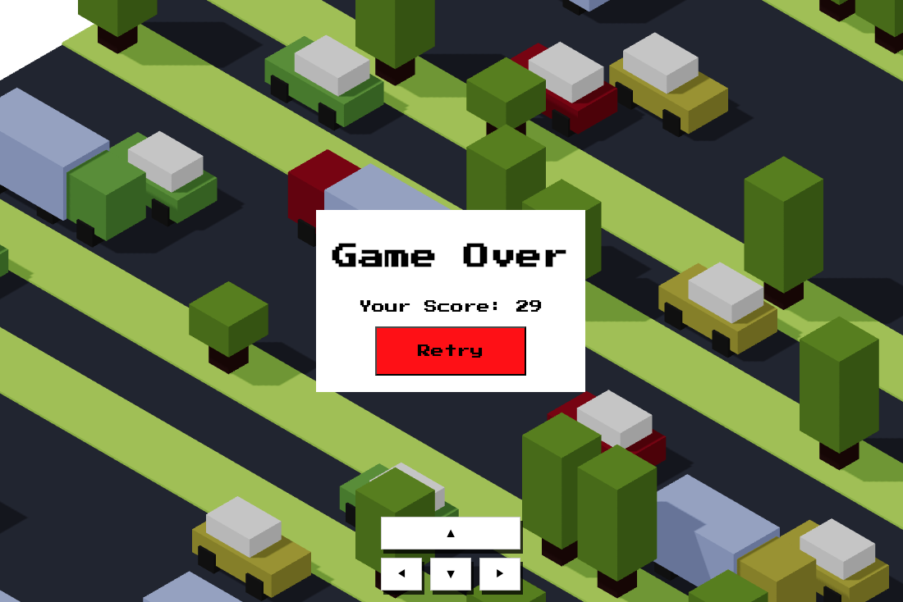

# Crossy Load Game

- React Three Fiber를 이용한 길건너 친구들 클론 프로젝트입니다.
- 사용 기술
  - TypeScript
  - React
  - Vite
  - React Three Fiber
- 배포 주소 : https://hardy-is-cat.github.io/crossy-load-game-ts/
- reference : [Crossy Road with React Three Fiber](https://javascriptgametutorials.com/tutorials/react-three-fiber/crossy-road)

|                     게임화면                      |
| :-----------------------------------------------: |
|      |
|                 **게임오버 화면**                 |
|  |
